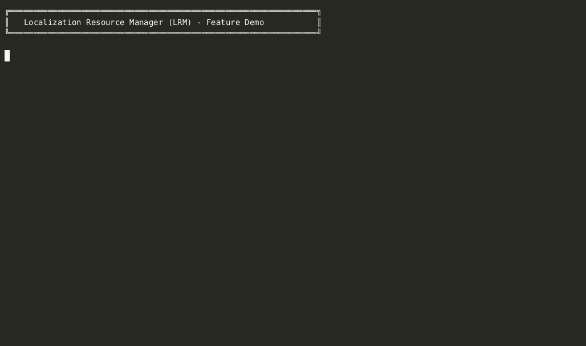

# Localization Resource Manager (LRM)

[](https://github.com/nickprotop/LocalizationManager/actions/workflows/ci.yml)
[](https://github.com/nickprotop/LocalizationManager/actions/workflows/release.yml)
[](https://github.com/nickprotop/LocalizationManager/releases)
[](https://github.com/nickprotop/LocalizationManager/discussions)
[](https://opensource.org/licenses/MIT)
[](https://dotnet.microsoft.com/download/dotnet/9.0)
[](https://github.com/nickprotop/LocalizationManager#installation)

A powerful C# .NET 9 console utility for managing .resx localization files with auto-discovery, validation, and rich CLI interface.

**Author:** Nikolaos Protopapas
**License:** MIT License
**Version:** 0.6.2

<p align="center">
  
</p>

---

## Why This Tool Exists

When developing .NET applications on Linux, managing localization resources becomes a challenge. While Windows developers have Visual Studio with its built-in .resx editor, **Linux developers have no native tools** for editing .NET localization files. Existing solutions require GUI applications or Windows-specific tools that don't work well in Linux environments.

This tool was created to fill that gap:

- **No Linux tools** - Nothing exists for editing .NET .resx files on Linux
- **Console-first design** - Perfect for server-side work and SSH sessions
- **Terminal UI included** - Interactive editing without leaving the terminal
- **Automation-friendly** - CLI commands for scripts and CI/CD pipelines
- **Developer workflow** - Validation, stats, and management in one tool
- **Cross-platform** - Works on Linux, macOS, and Windows

Whether you're developing on a Linux workstation, managing resources on a server, or working through SSH, LRM provides a complete solution for .NET localization management without requiring a GUI or Windows environment.

---

## Comparison with Alternatives

| Feature | LRM | ResXResourceManager | Zeta Resource Editor | Visual Studio | Manual Editing |
|---------|-----|---------------------|---------------------|---------------|----------------|
| **Linux Support** | ✅ Native | ❌ Windows only | ❌ Windows only | ❌ Windows only | ✅ Any editor |
| **Command Line** | ✅ Full CLI | ⚠️ PowerShell scripting | ❌ GUI only | ❌ GUI only | ⚠️ Manual XML |
| **Terminal UI** | ✅ Interactive TUI | ❌ | ❌ | ❌ | ❌ |
| **Auto-discovery** | ✅ Automatic | ⚠️ Manual selection | ⚠️ Manual selection | ⚠️ Manual selection | ❌ |
| **Validation** | ✅ Built-in | ✅ Yes | ✅ Yes | ⚠️ Basic | ❌ |
| **Statistics** | ✅ Charts + tables | ⚠️ Basic | ✅ Yes | ❌ | ❌ |
| **CSV Import/Export** | ✅ Yes | ✅ Excel | ✅ Excel | ❌ | ❌ |
| **CI/CD Ready** | ✅ Exit codes | ⚠️ Scripting | ❌ | ❌ | ⚠️ Custom scripts |
| **SSH-Friendly** | ✅ Terminal-based | ❌ | ❌ | ❌ | ✅ vim/nano |
| **No .NET Runtime** | ✅ Self-contained | ✅ Requires .NET | ✅ Requires .NET | ✅ Requires VS | ✅ |
| **Open Source** | ✅ MIT | ✅ MIT | ⚠️ Requires DevExpress | ❌ | N/A |
| **Installation** | Single binary | NuGet/Extension | Installer | Full IDE | None |
| **Best For** | Linux devs, CLI, CI/CD | VS users, automation | Windows GUI users | VS developers | Quick edits |

**Key Differentiators:**
- ✅ **Only** terminal-based tool with full TUI editor
- ✅ **Only** solution designed for Linux/.NET developers
- ✅ **Only** tool with auto-discovery of all languages
- ✅ **Only** CLI with built-in validation and statistics

---

## Features

### ✅ Current (v0.6.2)
- **Auto-discovery** - Automatically detects all .resx files and languages in a folder
- **Dynamic language support** - Use `--lang code:value` for any language in your project (no hardcoded languages!)
- **Language validation** - Invalid language codes show helpful errors with available languages
- **Validation** - Finds missing translations, duplicates, empty values, and extra keys
- **Statistics** - Shows translation coverage with beautiful tables and charts
- **View keys** - Display key details in table, JSON, or simple format
- **Add keys** - Add new localization keys to all languages at once
- **Update keys** - Modify existing key values with preview and confirmation
- **Delete keys** - Remove keys from all languages with confirmation
- **CSV Export** - Export translations to CSV with optional validation status
- **CSV Import** - Import translations from CSV with conflict resolution
- **Interactive TUI editor** - Side-by-side multi-column table view with Terminal.Gui
- **Smart help system** - Context-aware help messages (main help vs command-specific help)
- **Backup system** - Automatic backups before any modifications
- **Flexible paths** - Works with `--path` or `-p` argument, defaults to current directory
- **Rich UI** - Color-coded output using Spectre.Console
- **Multiple formats** - JSON output for automation and scripting
- **Cross-platform** - Runs on Linux, Windows, and macOS

### 🚧 Coming Soon
- **Code scanner** - Find Localizer usage and unused keys in .razor/.cs files
- **Translation API integration** - Auto-translate missing entries
- **Excel export/import** - Work with Excel files for translators

---

## Installation

### Option 1: Download Pre-built Binary (Recommended)

Download the latest release for your platform:

**Linux (64-bit Intel/AMD):**
```bash
# Download and extract
wget https://github.com/nickprotop/LocalizationManager/releases/download/v0.6.2/lrm-0.6.2-linux-x64.tar.gz
tar -xzf lrm-0.6.2-linux-x64.tar.gz

# Install system-wide
sudo cp lrm /usr/local/bin/
sudo chmod +x /usr/local/bin/lrm

# Or install for current user
mkdir -p ~/.local/bin
cp lrm ~/.local/bin/
chmod +x ~/.local/bin/lrm
# Add ~/.local/bin to PATH in ~/.bashrc or ~/.zshrc
```

**Linux (ARM64 - Raspberry Pi, etc.):**
```bash
wget https://github.com/nickprotop/LocalizationManager/releases/download/v0.6.2/lrm-0.6.2-linux-arm64.tar.gz
tar -xzf lrm-0.6.2-linux-arm64.tar.gz
# Installation same as above
```

**Windows (64-bit):**
1. Download `lrm-0.6.2-win-x64.zip`
2. Extract `lrm.exe` to a folder
3. Add folder to PATH or move `lrm.exe` to an existing PATH directory

**Windows (ARM64):**
1. Download `lrm-0.6.2-win-arm64.zip`
2. Extract and install same as above

### Option 2: Build from Source

**Prerequisites:**
- .NET 9.0 SDK or later
- `zip` command (for Windows archive creation)

**Quick Build:**
```bash
cd LocalizationManager
./build.sh
```

This automated script will:
- Run all 21 unit tests (must pass)
- Build for 4 platforms (Linux x64/ARM64, Windows x64/ARM64)
- Create distribution archives
- Display build summary

**Build Output:**
```
publish/
├── linux-x64/lrm           # 72MB
├── linux-arm64/lrm         # 78MB
├── win-x64/lrm.exe         # 72MB
├── win-arm64/lrm.exe       # 80MB
├── lrm-0.6.2-linux-x64.tar.gz      (~31MB)
├── lrm-0.6.2-linux-arm64.tar.gz    (~30MB)
├── lrm-0.6.2-win-x64.zip           (~31MB)
└── lrm-0.6.2-win-arm64.zip         (~30MB)
```

**Manual Build (Single Platform):**
```bash
# Build for current platform only
dotnet build

# Run from source
dotnet run -- validate --path ../Resources
```

**For detailed build instructions, see [BUILDING.md](BUILDING.md)**

### Shell Completion (Tab Completion)

**Modern Linux shells support tab completion** for faster command entry. LRM includes completion scripts for bash and zsh.

#### Bash Completion

**Option 1: System-wide (requires sudo)**
```bash
sudo cp lrm-completion.bash /etc/bash_completion.d/lrm
```

**Option 2: User-level**
```bash
mkdir -p ~/.local/share/bash-completion/completions
cp lrm-completion.bash ~/.local/share/bash-completion/completions/lrm
```

**Option 3: Manual sourcing**
```bash
# Add to ~/.bashrc
source /path/to/LocalizationManager/lrm-completion.bash
```

Then restart your shell or run: `source ~/.bashrc`

#### Zsh Completion

**Option 1: System-wide (requires sudo)**
```bash
sudo cp _lrm /usr/share/zsh/site-functions/_lrm
```

**Option 2: User-level**
```bash
# Create completion directory if it doesn't exist
mkdir -p ~/.zsh/completions

# Copy the completion file
cp _lrm ~/.zsh/completions/_lrm

# Add to your ~/.zshrc (if not already there)
fpath=(~/.zsh/completions $fpath)
autoload -Uz compinit
compinit
```

Then restart your shell or run: `exec zsh`

#### Testing Tab Completion

After installation, test it:
```bash
lrm <TAB>          # Shows all commands
lrm val<TAB>       # Completes to 'validate'
lrm view <TAB>     # Shows options
lrm --p<TAB>       # Completes to '--path'
```

**Features:**
- ✅ Command name completion
- ✅ Option/flag completion (`--path`, `-p`, `--help`, etc.)
- ✅ Directory completion for `--path`
- ✅ File completion for CSV imports
- ✅ Format completion for `view --format`
- ✅ Command-specific help hints

---

## Usage

**Tip:** Every command has its own detailed help screen. Use `lrm <command> --help` to see all options.

```bash
lrm validate --help    # Show validation command help
lrm view --help        # Show view command help
lrm update --help      # Show update command help
```

### Validate Resource Files
Checks for missing translations, duplicates, empty values, and extra keys.

```bash
# Validate resources in current directory
lrm validate

# Validate resources in a specific path
lrm validate --path /path/to/Resources

# Short form
lrm validate -p ./Resources
```

**Example Output:**
```
Scanning: /home/nick/source/medpractice-server/medpractice_server.Wasm/Resources

✓ Found 2 language(s):
  • English (Default) (default)
  • Ελληνικά (el)

Parsed English (Default): 252 entries
Parsed Ελληνικά (el): 252 entries

✓ All validations passed!
No issues found.
```

### Display Statistics
Shows translation coverage, key counts, and file sizes.

```bash
# Show stats for current directory
lrm stats

# Show stats for specific path
lrm stats --path /path/to/Resources

# Short form
lrm stats -p ./Resources
```

### View Specific Key
Display details for a single localization key.

```bash
# View key in table format (default)
lrm view SaveButton

# View with comments
lrm view SaveButton --show-comments

# JSON format (for scripting)
lrm view SaveButton --format json

# Simple text format
lrm view SaveButton --format simple
```

**JSON Output Example:**
```json
{
  "key": "Save",
  "translations": {
    "en": "Save",
    "el": "Αποθήκευση"
  }
}
```

### Add New Localization Key
Add a key to all language files at once.

**Language Arguments:** Use `--lang code:value` or `-l code:value` for each language. Language codes are auto-detected from your .resx files, and invalid codes are rejected with helpful error messages showing available languages.

```bash
# Interactive mode - prompts for all values
lrm add NewKey -i

# Prompt for values interactively (auto-prompts for missing)
lrm add NewKey

# Provide values via command line (dynamic language support)
lrm add WelcomeMessage --lang en:"Welcome" --lang el:"Καλωσόρισμα"

# Short form with multi-word values (use quotes!)
lrm add SaveButton -l en:"Save Changes" -l el:"Αποθήκευση Αλλαγών"

# Single word values don't need quotes, but it's safer to always use them
lrm add CancelButton --lang en:"Cancel" --lang el:"Ακύρωση"

# Add with comment
lrm add SaveButton --lang en:"Save" --lang el:"Αποθήκευση" --comment "Save button label"

# Interactive mode with comment
lrm add SaveButton -i --comment "Save button label"

# Skip automatic backup
lrm add TestKey -l en:"Test value" --no-backup

# Mix provided and prompted values (prompts for missing languages)
lrm add PartialKey --lang en:"English value"

# Invalid language code shows helpful error:
# ✗ Unknown language code: 'fr'
# Available languages: en, el
```

**Note:** The tool auto-detects available languages from your .resx files, so you can use any language code that exists in your project (e.g., `en`, `el`, `fr`, `de`, etc.).

### Update Existing Key Values
Modify values for an existing localization key.

**Language Arguments:** Same dynamic `--lang code:value` syntax as the add command. Only specified languages are updated; others remain unchanged. **Always use quotes for values!**

```bash
# Update specific language values (dynamic language support)
lrm update SaveButton --lang en:"Save Changes" --lang el:"Αποθήκευση Αλλαγών"

# Short form (use quotes for multi-word values!)
lrm update SaveButton -l en:"Save now" -l el:"Αποθήκευση τώρα"

# Interactive mode - prompts for each language
lrm update SaveButton -i

# Update comment only
lrm update SaveButton --comment "Updated button label"

# Skip confirmation and backup
lrm update SaveButton -l en:"Save" -y --no-backup

# Update only one language (others unchanged)
lrm update WelcomeMessage --lang en:"Welcome back!"
```

### Delete Localization Key
Remove a key from all language files.

```bash
# Delete with confirmation prompt
lrm delete OldKey

# Skip confirmation
lrm delete OldKey -y

# Delete without backup
lrm delete OldKey -y --no-backup
```

### Export to CSV
Export all translations to CSV format for external translators.

```bash
# Export to default file (resources.csv)
lrm export

# Export to specific file
lrm export -o translations.csv

# Include validation status column
lrm export --include-status -o export_with_status.csv
```

**CSV Format:**
```
Key,English (Default),Ελληνικά (el),Status,Comment
Save,Save,Αποθήκευση,OK,
Cancel,Cancel,Ακύρωση,OK,
```

### Import from CSV
Import translations from CSV files.

```bash
# Import (skip conflicts)
lrm import translations.csv

# Overwrite existing values
lrm import translations.csv --overwrite

# Skip automatic backup
lrm import translations.csv --no-backup
```

### Interactive TUI Editor
Launch the interactive Terminal UI editor for real-time editing.

```bash
# Edit resources in current directory
lrm edit

# Edit resources in specific path
lrm edit --path /path/to/Resources
```

**TUI Features:**
- **Search/Filter**: Type to filter keys in real-time
- **Edit Key**: Press Enter to edit selected key in all languages
- **Add Key**: Press Ctrl+N to add a new key with values for all languages
- **Delete Key**: Press Del to remove selected key (with confirmation)
- **Save**: Press Ctrl+S to save changes (prompts for backup)
- **Validate**: Press F6 to run validation without leaving editor
- **Help**: Press F1 to show keyboard shortcuts
- **Quit**: Press Ctrl+Q (prompts to save if there are unsaved changes)

**Example Workflow:**
1. Launch editor: `lrm edit --path ../Resources`
2. Type in search box to find a key
3. Press Enter to edit the key
4. Modify values in all languages
5. Press Ctrl+S to save with automatic backup
6. Press F6 to validate changes
7. Press Ctrl+Q to quit

---

## Complete Command Reference

### Global Options
All commands support these options:
- `-p, --path <PATH>` - Path to Resources folder (default: current directory)
- `-h, --help` - Show command help

### validate
**Description:** Validate resource files for issues

**Arguments:** None

**Options:**
- `-p, --path <PATH>` - Resource folder path

**Examples:**
```bash
lrm validate
lrm validate --path ../Resources
lrm validate -p ./Resources
```

### stats
**Description:** Display translation statistics and coverage

**Arguments:** None

**Options:**
- `-p, --path <PATH>` - Resource folder path

**Examples:**
```bash
lrm stats
lrm stats --path ./Resources
```

### view
**Description:** View details of a specific key

**Arguments:**
- `<KEY>` - The key to view

**Options:**
- `-p, --path <PATH>` - Resource folder path
- `--show-comments` - Include comments in output
- `--format <FORMAT>` - Output format: table (default), json, or simple

**Examples:**
```bash
lrm view SaveButton
lrm view SaveButton --show-comments
lrm view SaveButton --format json
```

### add
**Description:** Add a new key to all languages

**Arguments:**
- `<KEY>` - The key to add

**Options:**
- `-p, --path <PATH>` - Resource folder path
- `-l, --lang <CODE:VALUE>` - Language value (e.g., `en:"Save"`) - can be used multiple times
- `-i, --interactive` - Interactive mode (prompts for all language values)
- `--comment <COMMENT>` - Add comment
- `--no-backup` - Skip backup creation

**Examples:**
```bash
lrm add NewKey -i
lrm add NewKey --lang en:"Value" --lang el:"Τιμή"
lrm add SaveButton -i --comment "Button label"
lrm add TestKey -l en:"Test" -l el:"Δοκιμή" --no-backup
```

### update
**Description:** Update values for an existing key

**Arguments:**
- `<KEY>` - The key to update

**Options:**
- `-p, --path <PATH>` - Resource folder path
- `-l, --lang <CODE:VALUE>` - Language value (e.g., `en:"Save Changes"`) - can be used multiple times
- `--comment <COMMENT>` - Update comment
- `-i, --interactive` - Interactive mode (prompts for each language)
- `-y, --yes` - Skip confirmation
- `--no-backup` - Skip backup creation

**Examples:**
```bash
lrm update SaveButton --lang en:"Save Changes" --lang el:"Αποθήκευση Αλλαγών"
lrm update SaveButton -i
lrm update SaveButton -y --no-backup
```

### delete
**Description:** Delete a key from all languages

**Arguments:**
- `<KEY>` - The key to delete

**Options:**
- `-p, --path <PATH>` - Resource folder path
- `-y, --yes` - Skip confirmation
- `--no-backup` - Skip backup creation

**Examples:**
```bash
lrm delete OldKey
lrm delete OldKey -y
lrm delete OldKey -y --no-backup
```

### export
**Description:** Export to CSV format

**Arguments:** None

**Options:**
- `-p, --path <PATH>` - Resource folder path
- `-o, --output <FILE>` - Output CSV file (default: resources.csv)
- `--include-status` - Include validation status column

**Examples:**
```bash
lrm export
lrm export -o translations.csv
lrm export -o translations.csv --include-status
```

### import
**Description:** Import from CSV format

**Arguments:**
- `<FILE>` - CSV file to import

**Options:**
- `-p, --path <PATH>` - Resource folder path
- `--overwrite` - Overwrite existing values
- `--no-backup` - Skip backup creation

**Examples:**
```bash
lrm import translations.csv
lrm import translations.csv --overwrite
lrm import translations.csv --no-backup
```

### edit
**Description:** Launch interactive TUI editor

**Arguments:** None

**Options:**
- `-p, --path <PATH>` - Resource folder path

**Keyboard Shortcuts:**
- `Enter` - Edit selected key
- `Ctrl+N` - Add new key
- `Del` - Delete selected key
- `Ctrl+S` - Save changes
- `Ctrl+Q` - Quit editor
- `F1` - Show help
- `F6` - Run validation

**Examples:**
```bash
lrm edit
lrm edit --path ../Resources
```

---

## How It Works

### Auto-Discovery
LRM automatically scans a directory for .resx files and detects languages:

- `SharedResource.resx` → English (Default)
- `SharedResource.el.resx` → Greek (el)
- `SharedResource.fr.resx` → French (fr)
- Any culture code supported by .NET CultureInfo

### Validation Rules
1. **Missing Keys** - Keys in default language but not in translations
2. **Extra Keys** - Keys in translations but not in default language
3. **Duplicate Keys** - Same key appears multiple times in a file
4. **Empty Values** - Keys with null or whitespace values

### Resource File Format
LRM works with standard .NET .resx files (XML format):

```xml
<?xml version="1.0" encoding="utf-8"?>
<root>
  <data name="Save" xml:space="preserve">
    <value>Save</value>
    <comment>Optional comment</comment>
  </data>
  <data name="Cancel" xml:space="preserve">
    <value>Cancel</value>
  </data>
</root>
```

---

## Architecture

### Technology Stack
- **C# .NET 9** - Modern console application
- **Spectre.Console v0.53.0** - Rich CLI output (tables, colors, charts)
- **Spectre.Console.Cli v0.53.0** - Command-line argument parsing
- **Terminal.Gui v1.19.0** - Interactive TUI editor
- **System.Xml.Linq** - .resx XML parsing
- **System.Resources** - Native .resx support

### Design Patterns
- **Command Pattern** - Each operation is a separate command class
- **Repository Pattern** - ResourceFileParser abstracts .resx file access
- **Strategy Pattern** - ResourceValidator implements validation rules

---

## Development

### Requirements
- .NET 9.0 SDK
- Visual Studio Code, Visual Studio, or Rider (optional)
- Linux, Windows, or macOS

### Building
```bash
dotnet build
```

### Running Tests
```bash
# Run unit and integration tests (21 tests)
cd LocalizationManager.Tests
dotnet test

# Verbose output
dotnet test --verbosity detailed

# Test with actual resource files
dotnet run -- validate --path ../medpractice_server.Wasm/Resources
dotnet run -- stats --path ../medpractice_server.Wasm/Resources
```

**Test Suite:**
- **21 tests total** - All passing ✅
- **Unit tests** - ResourceFileParser, ResourceValidator, ResourceDiscovery
- **Integration tests** - Add, Update, Delete operations
- **Test coverage** - Core logic, CRUD operations, validation
- **Test data** - Included in `LocalizationManager.Tests/TestData/`

### Building Distribution
```bash
# Build all platforms with tests
./build.sh

# This creates self-contained executables for:
# - Linux x64/ARM64
# - Windows x64/ARM64
# - Archives ready for distribution
```

See [BUILDING.md](BUILDING.md) for detailed build instructions.

### Debugging
Open in Visual Studio Code or Visual Studio and debug normally. Set breakpoints in command files.

---

## Roadmap

#### Code Integration
- [ ] Scan .razor/.cs files for `Localizer["..."]` usage
- [ ] Detect unused resource keys
- [ ] Find hardcoded strings that should be localized
- [ ] Generate usage report

#### Translation Assistance
- [ ] Google Translate API integration (optional)
- [ ] DeepL API integration (optional)
- [ ] Auto-translate missing entries
- [ ] Translation memory suggestions

#### Advanced Features
- [ ] Batch operations (delete multiple keys)
- [ ] Undo/redo support in TUI
- [ ] JSON export/import
- [ ] Excel export/import
- [ ] Git integration (commit changes)
- [ ] Diff view between versions

---

## Contributing

This is a personal project for managing the medpractice-server localization files, but contributions are welcome!

### Guidelines
1. Follow existing code style (C# conventions)
2. Add MIT license headers to all new files
3. Write clear commit messages
4. Test with actual .resx files before submitting

---

## License

MIT License

Copyright (c) 2025 Nikolaos Protopapas

Permission is hereby granted, free of charge, to any person obtaining a copy
of this software and associated documentation files (the "Software"), to deal
in the Software without restriction, including without limitation the rights
to use, copy, modify, merge, publish, distribute, sublicense, and/or sell
copies of the Software, and to permit persons to whom the Software is
furnished to do so, subject to the following conditions:

The above copyright notice and this permission notice shall be included in all
copies or substantial portions of the Software.

THE SOFTWARE IS PROVIDED "AS IS", WITHOUT WARRANTY OF ANY KIND, EXPRESS OR
IMPLIED, INCLUDING BUT NOT LIMITED TO THE WARRANTIES OF MERCHANTABILITY,
FITNESS FOR A PARTICULAR PURPOSE AND NONINFRINGEMENT. IN NO EVENT SHALL THE
AUTHORS OR COPYRIGHT HOLDERS BE LIABLE FOR ANY CLAIM, DAMAGES OR OTHER
LIABILITY, WHETHER IN AN ACTION OF CONTRACT, TORT OR OTHERWISE, ARISING FROM,
OUT OF OR IN CONNECTION WITH THE SOFTWARE OR THE USE OR OTHER DEALINGS IN THE
SOFTWARE.

---

## Acknowledgments

- **Spectre.Console** - For the beautiful console UI
- **Terminal.Gui** - For the interactive TUI framework
- **.NET Team** - For the excellent .NET 9 platform

---

## Contact

**Author:** Nikolaos Protopapas
**Project:** medpractice-server
**Created:** 2025-11-09
