# LRM Cloud Platform

LRM Cloud is a web-based platform for team localization management with real-time collaboration, machine translation, and CLI synchronization.

**[Try LRM Cloud Free](https://lrm-cloud.com)**

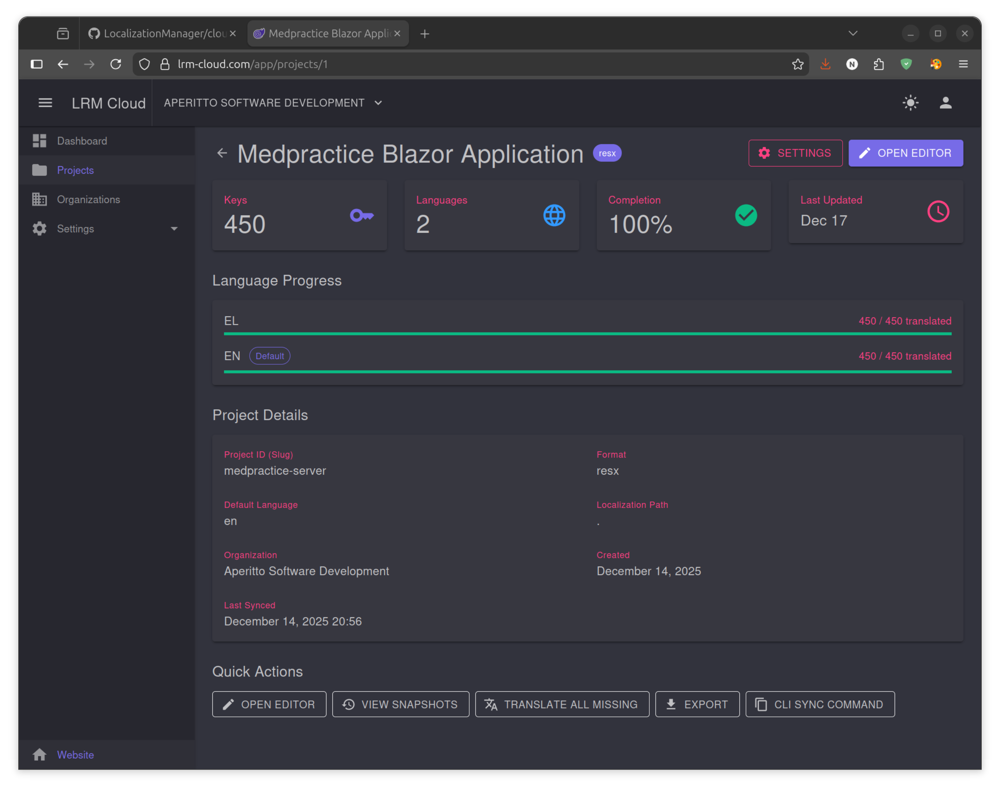

## 100% Open Source

LRM is a **fully open source project** under the MIT license. Unlike other localization platforms that only open-source parts of their system, LRM provides the **complete stack**:

- **CLI Tool** - Open source (MIT)
- **Cloud Backend API** - Open source (MIT)
- **Web Frontend** - Open source (MIT)
- **VS Code Extension** - Open source (MIT)
- **Docker Deployment** - Open source (MIT)

This means you can:
- **Self-host** with no feature restrictions
- **Modify** the source code for your needs
- **Audit** the code for security compliance
- **Contribute** improvements back to the community

## Deployment Options

### Option 1: Hosted Platform

Use our managed cloud platform at **[lrm-cloud.com](https://lrm-cloud.com)** — no setup required.

| Plan | Price | Best For |
|------|-------|----------|
| **Free** | $0/month | Personal projects, evaluation |
| **Team** | $9/month | Small teams, startups |
| **Enterprise** | $29/month | Large teams, high volume |

All plans include the full feature set. [See pricing details](#plans--pricing) for limits.

### Option 2: Self-Hosted (No Restrictions)

Deploy LRM Cloud on your own infrastructure using Docker Compose. **All features are available** — no artificial limitations, no phone-home, no license checks.

**Self-hosted benefits:**
- **Unlimited** translation characters (use your own API keys)
- **Unlimited** projects and team members
- **Complete data ownership** — your data stays on your servers
- **GDPR/compliance friendly** — control your data jurisdiction
- **Air-gapped deployments** — works offline with Ollama for translation
- **Customizable** — modify the source code as needed

**Requirements:**
- Docker & Docker Compose
- Linux server (Ubuntu 20.04+ recommended)
- Domain with SSL certificate (optional but recommended)

**Quick Start:**

```bash
# Clone the repository
git clone https://github.com/nickprotop/LocalizationManager.git
cd LocalizationManager/cloud/deploy

# Run interactive setup (first time only)
./setup.sh

# Build and deploy
./deploy.sh
```

The `setup.sh` script interactively configures:
- Database credentials and connection
- Domain name and SSL settings
- API keys for translation providers
- nginx configuration from templates

The `deploy.sh` script handles building and deploying.

**Self-Hosted Components:**

| Service | Purpose |
|---------|---------|
| nginx | Reverse proxy, SSL termination |
| api | REST API server (.NET 9) |
| web | Blazor WASM frontend |
| postgres | PostgreSQL 16 database |
| redis | Session cache |
| minio | S3-compatible storage (optional) |

For detailed deployment instructions, see [`cloud/deploy/README.md`](../cloud/deploy/README.md).

---

## Features

- **Web-based Translation Editor** - Edit translations in a spreadsheet-like interface
- **Multiple Translation Providers** - Google, DeepL, OpenAI, Claude, Azure, and more
- **Translation Memory** - Automatic caching for cost savings and consistency
- **Glossary Management** - Enforce consistent terminology across translations
- **CLI Sync** - Bidirectional sync between local files and cloud with three-way merge
- **GitHub Integration** - Connect repositories, push/pull translations, auto-create PRs
- **Team Collaboration** - Organizations with role-based access control
- **Multi-format Support** - RESX, JSON, i18next, Android XML, iOS strings

## Dashboard

The dashboard provides an overview of your localization projects:

- **Project count** and total keys across all projects
- **Average completion** percentage
- **LRM Usage** - Translation character consumption
- **Recent Projects** with quick access to edit and settings

## Projects

Each project contains your localization resources in a specific format.

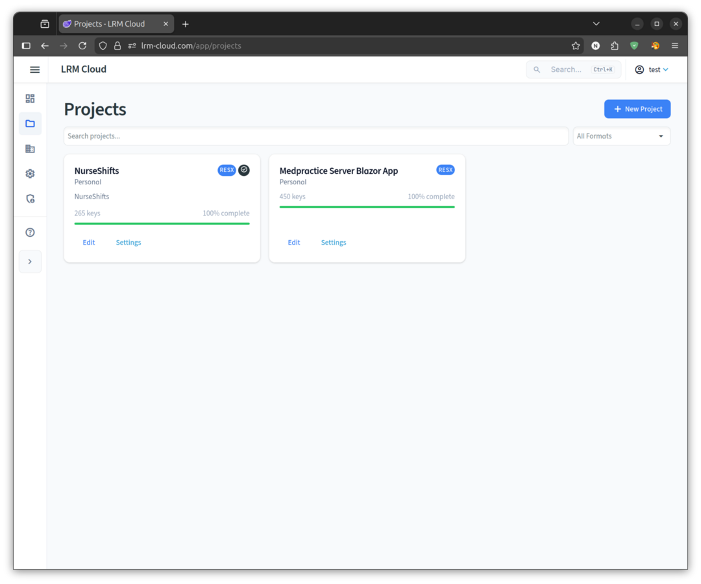

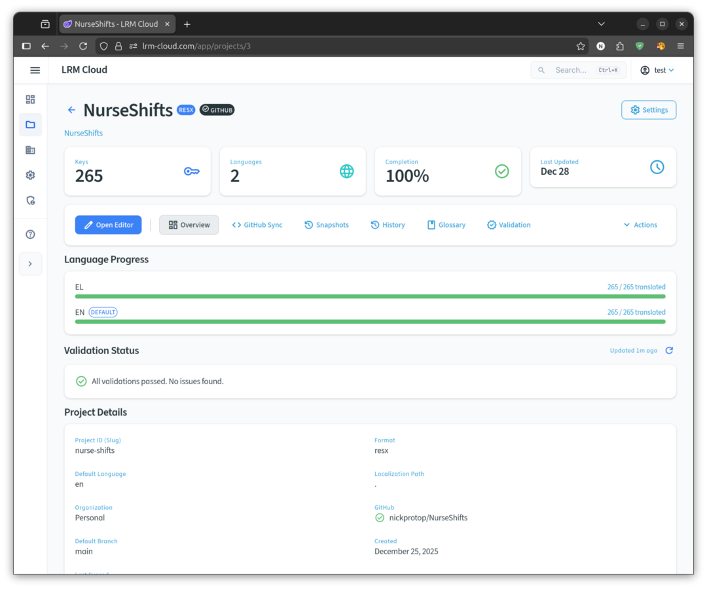

### Project Overview

The project detail page shows:

- **Key Statistics** - Total keys, languages, completion percentage
- **Language Progress** - Per-language translation status with progress bars
- **Validation Status** - Real-time validation for duplicates, missing translations, and placeholder mismatches
- **Project Details** - Format, default language, localization path, sync status
- **Quick Actions** - Open Editor, View Snapshots, Sync History, Glossary, Validation, Translate

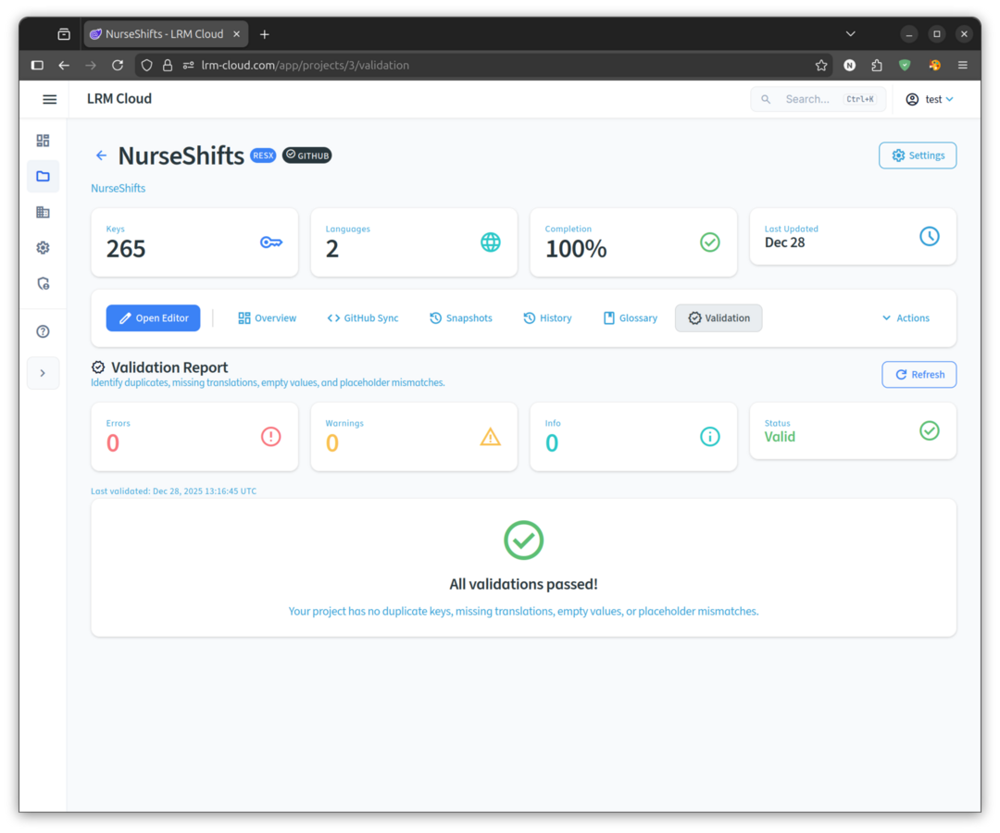

### Creating a Project

1. Click **"New Project"** from the dashboard
2. Enter a project name and slug
3. Select the resource format (RESX, JSON, i18next, Android, iOS)
4. Set the default language (source language)
5. Click **"Create"**

### Importing Existing Resources

You can import resources from:
- **ZIP archive** - Upload a ZIP containing your localization files
- **CLI Push** - Use `lrm cloud push` to upload from your local project

## Translation Editor

The web-based editor provides a powerful interface for managing translations.

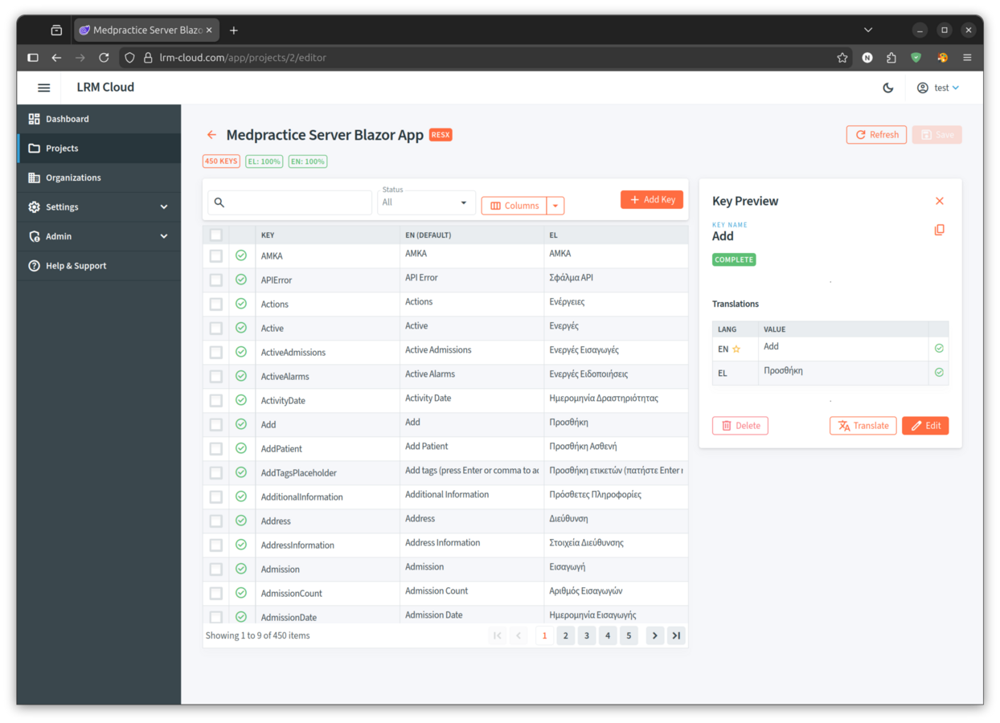

### Features

- **Multi-language Grid** - View all languages side by side
- **Key Preview Panel** - Detailed view of selected key with all translations
- **Search & Filter** - Find keys by name, value, or status
- **Status Indicators** - See which translations are complete, missing, or need review
- **Bulk Selection** - Select multiple keys for batch operations
- **Column Visibility** - Show/hide languages as needed

### Editing Translations

1. Click on any cell to select a key
2. View details in the **Key Preview** panel on the right
3. Click **"Edit"** to modify values
4. Changes are saved automatically

### Adding Keys

1. Click **"+ Add Key"** in the toolbar
2. Enter the key name
3. Provide the default language value
4. Optionally add a comment for translators
5. Click **"Save"**

## Translation

LRM Cloud offers multiple translation options to fit your workflow and budget.

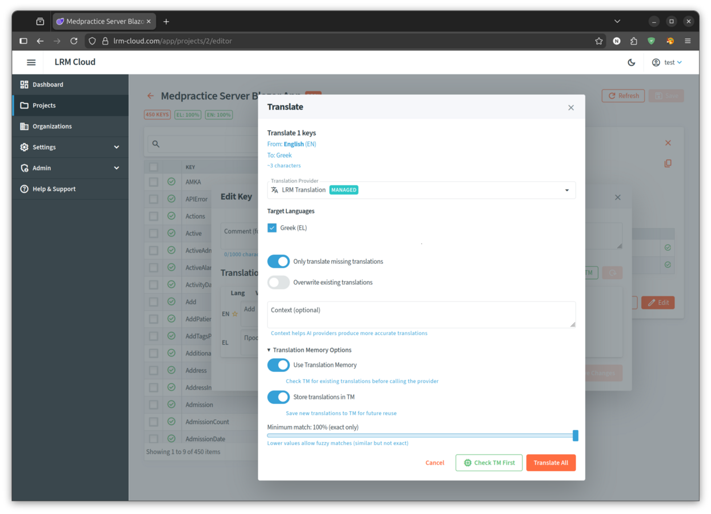

### Translation Providers

| Type | Description | Examples |
|------|-------------|----------|
| **LRM Managed** | We handle the API - no key needed | LRM Translation |
| **BYOK (Bring Your Own Key)** | Use your own API keys | Google, DeepL, OpenAI, Claude, Azure |
| **Free Providers** | Community providers, no API key | MyMemory, Lingva |

### Translating Keys

1. Select one or more keys in the editor
2. Click **"Translate"** in the toolbar
3. Choose the **Translation Provider**
4. Select **Target Languages**
5. Configure options:
   - **Only translate missing** - Skip already translated keys
   - **Overwrite existing** - Replace current translations
   - **Context** - Provide context for AI providers
6. Enable **Translation Memory** options:
   - **Use Translation Memory** - Check TM before calling provider
   - **Store translations in TM** - Save new translations for reuse
   - **Minimum match** - Fuzzy match threshold (100% = exact only)
7. Click **"Translate All"**

### Configuring Providers

To use your own API keys:

1. Go to **Settings** > **Translation Providers**
2. Click **"Configure"** on a provider
3. Enter your API key
4. Click **"Save & Test"** to verify

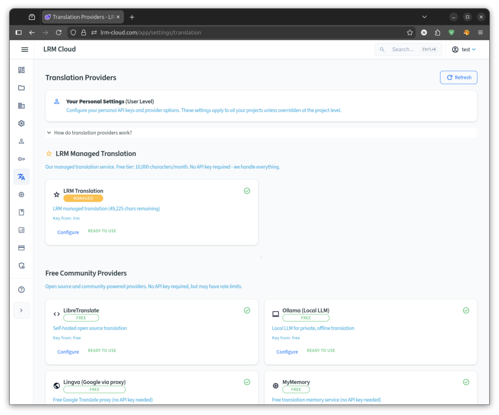

Project-level overrides are available in **Project Settings** > **Translation** tab.

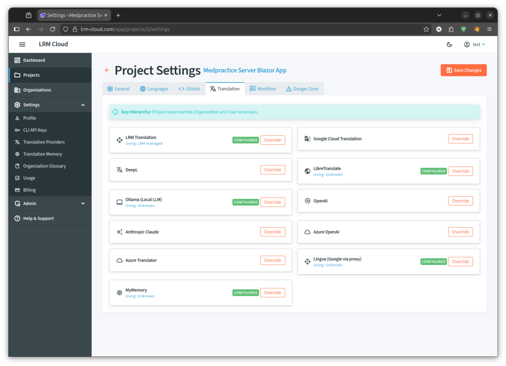

## Translation Memory

Translation Memory (TM) automatically stores translations for reuse, saving costs and ensuring consistency.

### How It Works

1. **TM Check** - Before calling a provider, TM is searched for matches
2. **Exact Match (100%)** - Reused immediately, no API call needed
3. **Fuzzy Match (70-99%)** - Suggested based on similarity threshold
4. **No Match** - Provider is called, result stored in TM

### Benefits

- **Cost Savings** - Avoid redundant API calls
- **Consistency** - Same text always produces same translation
- **Speed** - Instant matches from cache
- **Learning** - TM grows with every translation

### TM Levels

- **Personal TM** - Your individual translations
- **Organization TM** - Shared across team members (Team/Enterprise plans)

## Glossary

Define approved terminology to ensure consistent translations.

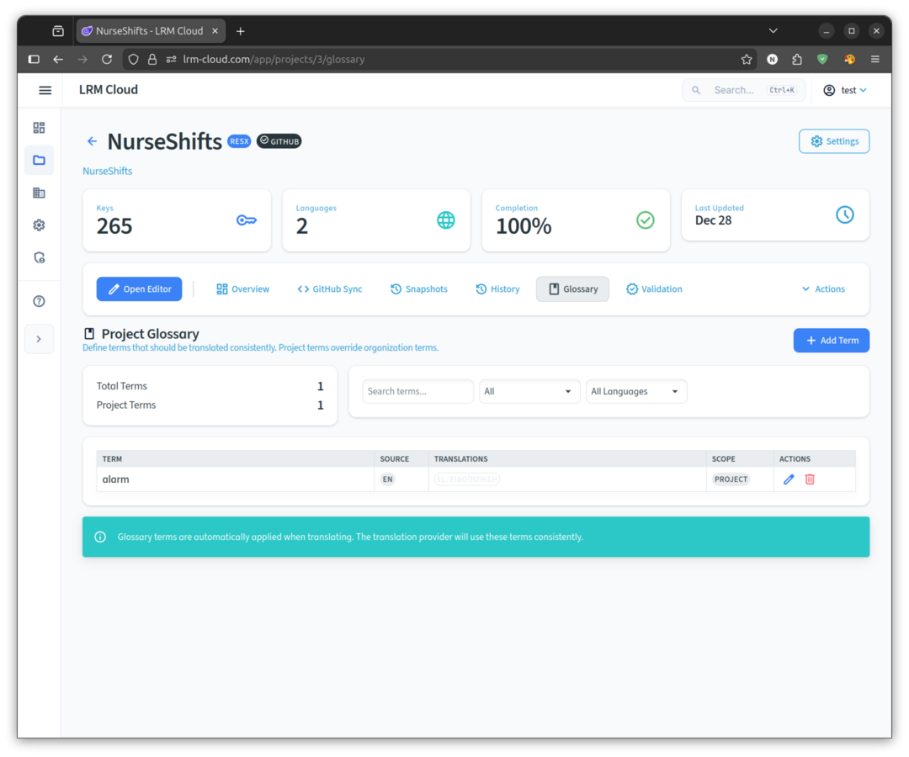

### Use Cases

- **Brand Terms** - Product names that shouldn't be translated
- **Domain Terminology** - Industry-specific terms
- **Consistency** - Same term always translates the same way

### Managing Terms

1. Open project **Glossary** from Quick Actions
2. Click **"Add Term"**
3. Enter source term and translations per language
4. Set case sensitivity if needed
5. Click **"Save"**

Glossary terms are automatically enforced when using AI providers (OpenAI, Claude).

## Sync History

Track all push and revert operations with full audit trail.

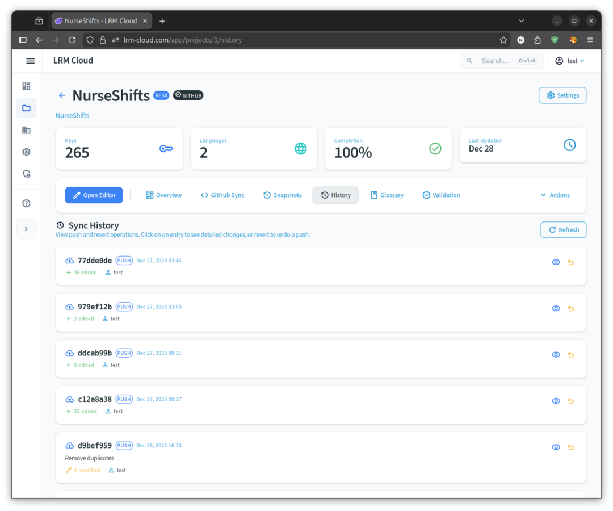

### Viewing History

The Sync History page shows:
- **Operation ID** - Unique identifier for each push/revert
- **Type** - Push, revert, or web edit
- **Timestamp** - When the operation occurred
- **Changes** - Keys added, modified, or deleted
- **User** - Who performed the operation

### Reverting Changes

1. Find the push you want to undo in history
2. Click the **revert** icon
3. Confirm the revert operation
4. A new history entry is created for the revert

## Snapshots

Snapshots are point-in-time backups of your project's translations. Use them to track changes and restore to previous states.

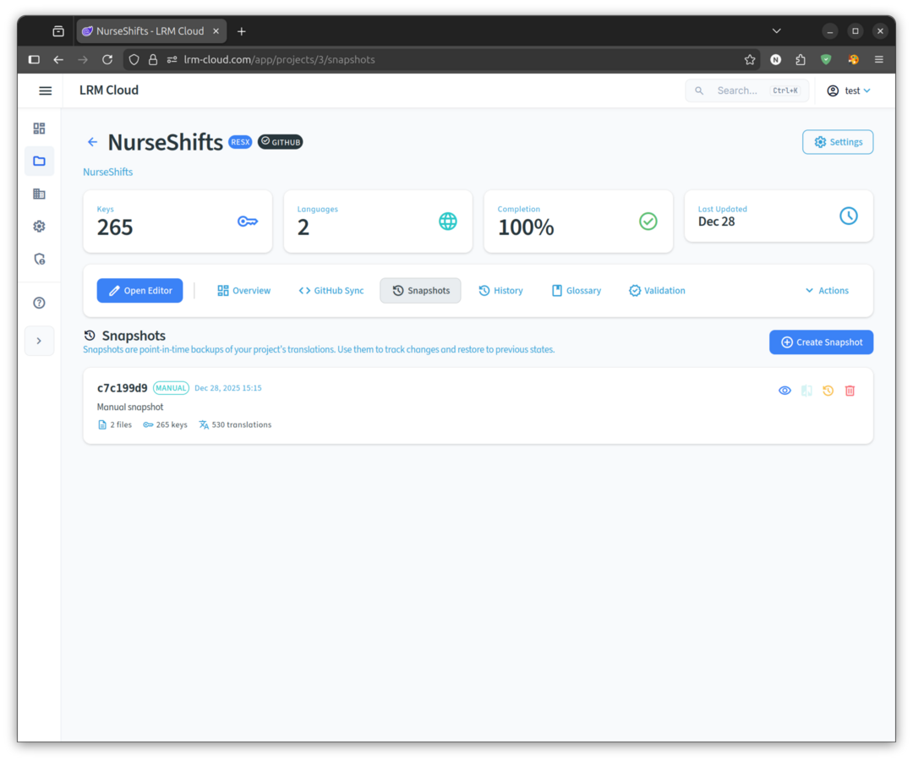

### Creating Snapshots

1. Go to **Project** > **Snapshots** tab
2. Click **"Create Snapshot"**
3. Add an optional description
4. Click **"Create"**

Snapshots can be viewed, compared, and restored at any time.

## CLI Sync

Synchronize local resource files with LRM Cloud using the CLI.

### Quick Start

```bash
# Clone a cloud project
lrm cloud clone https://lrm-cloud.com/@username/my-project

# Or link existing project
lrm remote set https://lrm-cloud.com/@username/my-project
lrm cloud login
```

### Daily Workflow

```bash
# Pull latest changes
lrm cloud pull

# Make local changes...

# Push changes to cloud
lrm cloud push
```

### Key Commands

| Command | Description |
|---------|-------------|
| `lrm cloud clone <url>` | Clone a cloud project |
| `lrm cloud push` | Upload local changes |
| `lrm cloud pull` | Download cloud changes |
| `lrm cloud status` | Show sync status |
| `lrm cloud log` | View sync history |
| `lrm cloud revert <id>` | Undo a previous push |
| `lrm cloud snapshot create` | Create a named snapshot |

See [Cloud Sync Guide](CLOUD_SYNC.md) for complete documentation.

## GitHub Integration

Connect your GitHub repository to LRM Cloud for seamless version control integration.

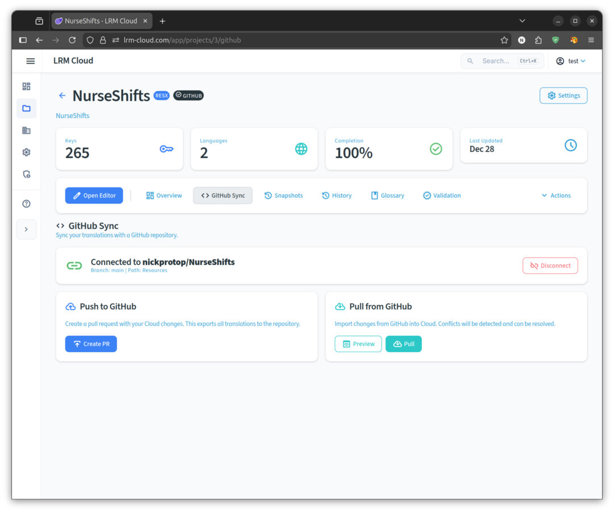

### Connecting a Repository

1. Go to **Project Settings** > **GitHub**
2. Click **"Connect to GitHub"**
3. Authorize LRM Cloud to access your repository
4. Select the repository and branch

### Push to GitHub

Push translations from LRM Cloud to your GitHub repository:

1. Make changes in the web editor or via CLI sync
2. Click **"Push to GitHub"** in project settings
3. LRM creates a branch and opens a pull request
4. Review and merge the PR in GitHub

### Pull from GitHub

Pull translations from GitHub into LRM Cloud:

1. Click **"Pull from GitHub"** in project settings
2. LRM performs a **three-way merge**:
   - Compares GitHub, Cloud, and last synced state
   - Auto-merges non-conflicting changes
   - Presents conflicts for manual resolution
3. Review and apply changes

### Three-Way Merge

LRM uses proper three-way merge (like Git) at every sync boundary:

- **CLI ↔ Cloud**: Merges local file changes with cloud changes
- **Cloud ↔ GitHub**: Merges cloud edits with repository changes

This means:
- Changes in different places merge automatically
- Same change in both places = no conflict
- Only truly divergent changes require resolution
- No accidental overwrites

### Conflict Resolution

When conflicts occur:

| Strategy | Description |
|----------|-------------|
| **GitHub** | Accept all GitHub values |
| **Cloud** | Keep all Cloud values |
| **Prompt** | Choose per-conflict in UI |

## Teams & Organizations

Organizations enable team collaboration on localization projects.

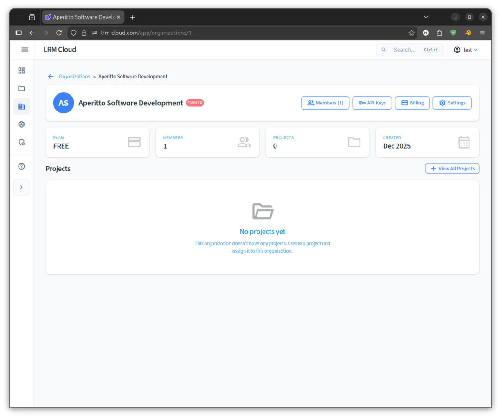

### Roles

| Role | Permissions |
|------|-------------|
| **Owner** | Full access, billing, delete org |
| **Admin** | Manage projects, members, settings |
| **Member** | Edit resources, translate, sync |
| **Viewer** | View only, export |

### Creating an Organization

1. Go to **Organizations** in the sidebar
2. Click **"Create Organization"**
3. Enter name and optional description
4. Invite team members

## Plans & Pricing

| Feature | Free | Team ($9/mo) | Enterprise ($29/mo) |
|---------|------|--------------|---------------------|
| LRM Translation | 5K chars/mo | 50K chars/mo | 500K chars/mo |
| BYOK Translation | 25K chars/mo | 250K chars/mo | 2.5M chars/mo |
| Projects | 3 | Unlimited | Unlimited |
| Team Members | - | 10 | Unlimited |
| Organizations | - | Yes | Yes |
| Cloud Storage | 25 MB | 250 MB | 500 MB |
| Snapshots | 3/project | 10/project | 30/project |

## Getting Started

1. **Create Account** - Sign up at [lrm-cloud.com/app/register](https://lrm-cloud.com/app/register)
2. **Create Project** - Click "New Project" and configure format
3. **Import Resources** - Upload ZIP or push via CLI
4. **Start Translating** - Use the web editor or CLI

## OTA (Over-The-Air) Localization

Update translations in real-time without redeploying your .NET application. LRM is the **first and only OTA localization solution for .NET**!

### How OTA Works

1. Your .NET app starts and loads local/embedded resources
2. Background service fetches translations from LRM Cloud
3. Translations sync automatically (default: every 5 minutes)
4. Changes in LRM Cloud reflect in your app without redeployment

### Quick Setup

```csharp
// Program.cs
builder.Services.AddJsonLocalizationWithOta(options =>
{
    options.UseOta(
        endpoint: "https://lrm-cloud.com",
        apiKey: "lrm_your_read_only_api_key",
        project: "@username/my-project"  // or "org/project"
    );
});
```

### Creating an API Key

1. Go to **Project Settings** > **API Keys**
2. Click **"Create API Key"**
3. Select **"Read"** scope (sufficient for OTA)
4. Copy the key (`lrm_...`)

### OTA Configuration Options

| Option | Default | Description |
|--------|---------|-------------|
| `Endpoint` | `https://lrm-cloud.com` | LRM Cloud API endpoint |
| `ApiKey` | - | API key with read scope (required) |
| `Project` | - | Project path: `@user/project` or `org/project` |
| `RefreshInterval` | 5 minutes | How often to check for updates |
| `FallbackToLocal` | true | Use local resources when offline |
| `Timeout` | 10 seconds | HTTP request timeout |
| `MaxRetries` | 3 | Retry attempts for failed requests |

### Supported Platforms

OTA works with the entire .NET ecosystem:

- ASP.NET Core (Web APIs, MVC, Razor Pages)
- Blazor (Server + WebAssembly)
- .NET MAUI (iOS, Android, Windows, macOS)
- Avalonia (Cross-platform desktop)
- WPF and WinForms
- Console applications
- Azure Functions / AWS Lambda
- Worker Services

### Network Resilience

The OTA client includes:

- **Retry with exponential backoff** - Automatically retries failed requests
- **Circuit breaker** - Stops requests after repeated failures, auto-recovers
- **ETag caching** - Efficient bandwidth usage, only fetches when changed
- **Graceful fallback** - Uses local resources when cloud is unavailable

### Generator Package Compatibility

When using OTA with `LocalizationManager.JsonLocalization.Generator`:

- Generated classes work for compile-time keys
- New OTA keys use dynamic access: `Strings.Localizer["NewKey"]`

### Sample Project

The [ConsoleApp.OtaDemo](https://github.com/nickprotop/LocalizationManager/tree/main/samples/ConsoleApp.OtaDemo) sample demonstrates all OTA features using a mock HTTP handler - **no real LRM Cloud server required**:

- Initial bundle fetch
- ETag caching (304 Not Modified)
- Multi-language support
- CLDR pluralization
- Live translation updates
- Fallback to embedded resources

Run it directly to see OTA in action:

```bash
cd samples/ConsoleApp.OtaDemo
dotnet run
```

See the [NuGet package documentation](https://www.nuget.org/packages/LocalizationManager.JsonLocalization) for full OTA API details.

## See Also

- [Cloud Sync Guide](CLOUD_SYNC.md) - Complete CLI sync documentation
- [Cloud Sync Quick Start](CLOUD_SYNC_QUICKSTART.md) - 5-minute quick start
- [Translation Guide](TRANSLATION.md) - Translation providers and options
- [Commands Reference](COMMANDS.md) - All CLI commands
