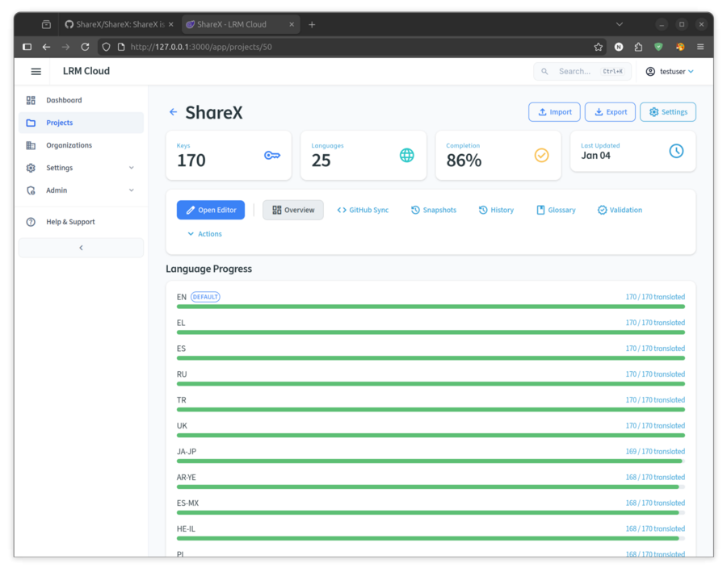
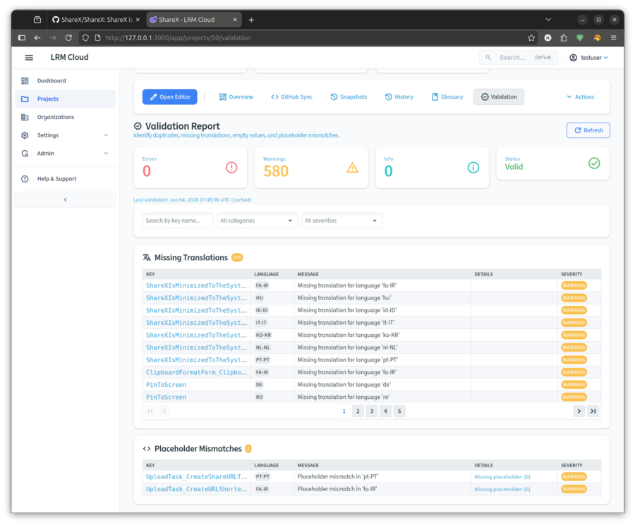
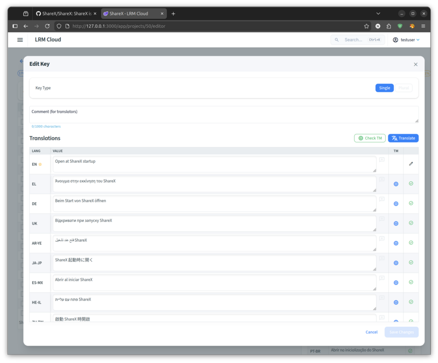
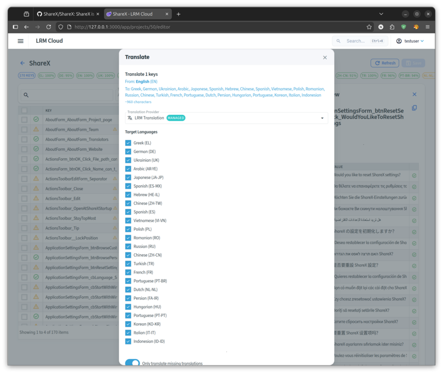
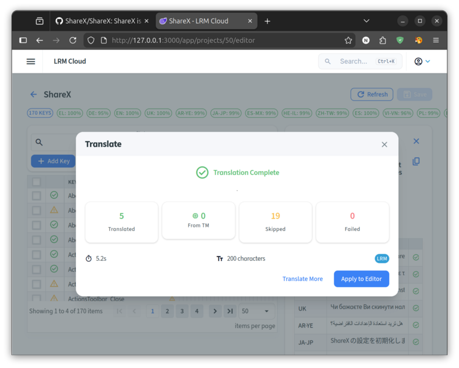

# Case Study: Completing ShareX Translations with LRM

## About ShareX

[ShareX](https://github.com/ShareX/ShareX) is a popular open-source screen capture and sharing tool with **35K+ GitHub stars**. It supports 24 languages, but many have incomplete translations.

## The Challenge

- **170 translatable strings** in the core application
- Languages like Spanish (es) at only 37% coverage (63/170 strings)
- No Greek translation available at all
- No automated translation workflow

## The Solution: LRM CLI

Using the LRM (Localization Resource Manager) CLI, we completed translations in under 5 minutes.

All commands run from inside the resources folder:

```bash
cd ~/Desktop/ShareX/ShareX/Properties
```

---

## Use Case 1: Analyze Translation Coverage

```bash
lrm stats
```

```
                            Localization Statistics
┌──────────────┬──────┬────────────┬───────┬─────────┬──────────┬───────────┐
│ Language     │ Keys │ Translated │ Empty │ Missing │ Coverage │ File Size │
├──────────────┼──────┼────────────┼───────┼─────────┼──────────┼───────────┤
│ Default      │ 170  │ 170        │ 0     │ 0       │ 100.0%   │ 69.9 KB   │
│ ar-YE        │ 168  │ 168        │ 0     │ 2       │ 98.8%    │ 26.8 KB   │
│ de           │ 161  │ 161        │ 0     │ 9       │ 94.7%    │ 29.1 KB   │
│ el           │ 170  │ 170        │ 0     │ 0       │ 100.0%   │ 29.2 KB   │
│ es           │ 170  │ 170        │ 0     │ 0       │ 100.0%   │ 28.5 KB   │
│ hu           │ 62   │ 62         │ 0     │ 108     │ 36.5%    │ 15.2 KB   │
│ ja-JP        │ 169  │ 169        │ 0     │ 1       │ 99.4%    │ 31.2 KB   │
│ ru           │ 170  │ 170        │ 0     │ 0       │ 100.0%   │ 33.6 KB   │
│ ...          │      │            │       │         │          │           │
└──────────────┴──────┴────────────┴───────┴─────────┴──────────┴───────────┘
```

---

## Use Case 2: List All Languages

```bash
lrm list-languages
```

```
Resource Files: Resources

┌──────────────┬───────────┬──────────────────────┬─────────┬──────────┐
│ Language     │ Code      │ File                 │ Entries │ Coverage │
├──────────────┼───────────┼──────────────────────┼─────────┼──────────┤
│ Default      │ (default) │ Resources.resx       │     170 │   100% ✓ │
│ Arabic       │ ar-YE     │ Resources.ar-YE.resx │     168 │      98% │
│ German       │ de        │ Resources.de.resx    │     161 │      94% │
│ Greek        │ el        │ Resources.el.resx    │     170 │   100% ✓ │
│ Spanish      │ es        │ Resources.es.resx    │     170 │   100% ✓ │
│ Hungarian    │ hu        │ Resources.hu.resx    │      62 │      36% │
│ Indonesian   │ id-ID     │ Resources.id-ID.resx │     113 │      66% │
│ Japanese     │ ja-JP     │ Resources.ja-JP.resx │     169 │      99% │
│ Russian      │ ru        │ Resources.ru.resx    │     170 │   100% ✓ │
│ Turkish      │ tr        │ Resources.tr.resx    │     170 │   100% ✓ │
│ ...          │           │                      │         │          │
└──────────────┴───────────┴──────────────────────┴─────────┴──────────┘

Total: 25 languages
```

---

## Use Case 3: View Specific Key Across All Languages

```bash
lrm view "Error"
```

```
Keys: 1
Matched 1 key(s)

┌───────┬──────────────────┬───────────┐
│ Key   │ Language         │ Value     │
├───────┼──────────────────┼───────────┤
│ Error │ Default          │ Error     │
│       │ ar-YE (Arabic)   │ [Arabic]  │
│       │ de (German)      │ Fehler    │
│       │ el (Greek)       │ Sfalma    │
│       │ es (Spanish)     │ Error     │
│       │ fa-IR (Persian)  │ (missing) │
│       │ fr (French)      │ Erreur    │
│       │ hu (Hungarian)   │ (missing) │
│       │ ja-JP (Japanese) │ [Japanese]│
│       │ pl (Polish)      │ Blad      │
│       │ ru (Russian)     │ [Russian] │
│       │ zh-CN (Chinese)  │ [Chinese] │
│       │ zh-TW (Chinese)  │ [Chinese] │
└───────┴──────────────────┴───────────┘

Showing 1 occurrence(s) across 25 language(s)
```

---

## Use Case 4: View Keys with Wildcard Pattern

```bash
lrm view "ShareX*"
```

```
Pattern: ShareX* (wildcard)
Matched 5 key(s)

┌──────────────────────────┬──────────────┬──────────────────────────┐
│ Key                      │ Language     │ Value                    │
├──────────────────────────┼──────────────┼──────────────────────────┤
│ ShareXIsMinimizedToTheSy │ Default      │ ShareX is minimized to   │
│ stemTray                 │              │ the system tray.         │
│                          │ el (Greek)   │ To ShareX                │
│                          │              │ elaxistopoieitai sto     │
│                          │              │ disko tou systimatos.    │
│                          │ es (Spanish) │ ShareX se minimiza a la  │
│                          │              │ bandeja del sistema.     │
│                          │ hu (Hungar.) │ (missing)                │
│                          │ ja-JP (Jap.) │ ShareX ha system tray ni │
│                          │              │ saishouka sarete imasu.  │
├──────────────────────────┼──────────────┼──────────────────────────┤
│ ShareXIsUpToDate         │ Default      │ ShareX is up to date!    │
│                          │ el (Greek)   │ To ShareX einai          │
│                          │              │ enimeromena!             │
│                          │ es (Spanish) │ ShareX esta al dia!      │
│                          │ hu (Hungar.) │ (missing)                │
└──────────────────────────┴──────────────┴──────────────────────────┘
```

---

## Use Case 5: Add New Language

```bash
lrm add-language -c el -y
```

```
✓ Culture code valid: Greek
✓ Using base name: Resources
► Copying 170 entries from default language...
✓ Created: Resources.el.resx
✓ Added Greek (el) language
```

---

## Use Case 6: Configure Translation Provider

```bash
lrm config set-api-key --provider deepl --key YOUR_DEEPL_API_KEY
```

```
✓ API key for 'deepl' stored successfully.

Stored in: ~/.local/share/LocalizationManager/credentials.json

The API key is now ready to use. No additional configuration needed.

For CI/CD, use environment variables instead:
  export LRM_DEEPL_API_KEY="your-key"
```

---

## Use Case 7: Translate New Language

```bash
lrm translate "*" --provider deepl --source-language en --target-languages el --overwrite
```

```
Translating...

┌────────────────────────────┬──────────┬────────────────────────────┬──────────┐
│ Key                        │ Language │ Translation                │ Status   │
├────────────────────────────┼──────────┼────────────────────────────┼──────────┤
│ ShareXIsMinimizedToTheSyst │ el       │ To ShareX elaxistopoieitai │ ✓        │
│ emTray                     │          │ sto disko tou systimatos.  │          │
│ PinToScreen                │ el       │ Karfitsa stin othoni       │ ✓        │
│ InspectWindow_ProcessName  │ el       │ Onoma diergasias           │ ✓        │
│ SwitchToThumbnailView      │ el       │ Enallagi se provoli        │ ✓        │
│                            │          │ mikrografioon              │          │
│ ShareXIsUpToDate           │ el       │ To ShareX einai            │ ✓        │
│                            │          │ enimeromeno!               │          │
│ ScreenColorPicker          │ el       │ Epilogi xromatos othonis   │ ✓        │
│ ClipboardUpload            │ el       │ Anevasma proxeirou         │ ✓        │
│ Error                      │ el       │ Sfalma                     │ (cached) │
│ ...                        │          │                            │          │
└────────────────────────────┴──────────┴────────────────────────────┴──────────┘

Translated 170 of 170 keys.
✓ Translation completed successfully.
```

---

## Use Case 8: Translate Only Missing Strings

```bash
lrm translate "*" --provider deepl --source-language en --target-languages es --only-missing
```

```
Translating...

┌─────────────────────────────┬──────────┬────────────────────────────┬────────┐
│ Key                         │ Language │ Translation                │ Status │
├─────────────────────────────┼──────────┼────────────────────────────┼────────┤
│ ShareXIsMinimizedToTheSyste │ es       │ ShareX se minimiza a la    │ ✓      │
│ ...                         │          │ bandeja del s...           │        │
│ PinToScreen                 │ es       │ Pin a pantalla             │ ✓      │
│ ShareXIsUpToDate            │ es       │ ¡ShareX está al día!       │ ✓      │
│ ScreenColorPicker           │ es       │ Selector de color de       │ ✓      │
│                             │          │ pantalla                   │        │
│ ...                         │          │                            │        │
└─────────────────────────────┴──────────┴────────────────────────────┴────────┘

Translated 107 of 170 keys (63 already had translations).
✓ Translation completed successfully.
```

---

## Use Case 9: Validate Translations

```bash
lrm validate
```

```
Scanning: ~/Desktop/ShareX/ShareX/Properties

✓ Found 25 language(s) (resx backend):
  • Default (default)
  • Arabic (ar-YE)
  • German (de)
  • Greek (el)
  • Spanish (es)
  • French (fr)
  • Hungarian (hu)
  • Japanese (ja-JP)
  • Russian (ru)
  • ...

Parsed Default: 170 entries
Parsed Greek (el): 170 entries
Parsed Spanish (es): 170 entries
...

⚠ Validation found 580 issue(s)

                              Missing Translations
┌──────────┬───────────────────────────────────────────────────────────────────┐
│ Language │ Missing Keys                                                      │
├──────────┼───────────────────────────────────────────────────────────────────┤
│ hu       │ ShareXIsMinimizedToTheSystemTray, PinToScreen,                    │
│          │ InspectWindow_ProcessName, SwitchToThumbnailView, ... (98 more)   │
│ fa-IR    │ ShareXIsMinimizedToTheSystemTray, PinToScreen, ... (57 more)      │
│ nl-NL    │ ShareXIsMinimizedToTheSystemTray, PinToScreen, ... (74 more)      │
└──────────┴───────────────────────────────────────────────────────────────────┘
```

---

## Use Case 10: Find Unused Keys in Codebase

```bash
lrm scan
```

```
Scanning source: ~/Desktop/ShareX/ShareX
Resource path: ~/Desktop/ShareX/ShareX/Properties

Excluding 166 file references from missing keys report
Scanning source files...

✓ Scanned 107 files
Found 410 key references (298 unique keys)

                      Missing Keys (in code, not in .resx)
╭────────────────────────────────┬────────────┬────────────────────────────────╮
│ Key                            │ References │ Locations                      │
├────────────────────────────────┼────────────┼────────────────────────────────┤
│ AboutForm_AboutForm_Language_  │ 1          │ AboutForm.cs:107               │
│ he_IL                          │            │                                │
│ application_resize_full        │ 2          │ TaskHelpers.cs:1977,1978       │
│ application_search_result      │ 1          │ TaskHelpers.cs:1980            │
│ Icon                           │ 6          │ MainForm.cs:80,81,957...,      │
│                                │            │ TaskManager.cs:483,488         │
│ images_flickr                  │ 1          │ TaskHelpers.cs:1961            │
│ IsDarkTheme                    │ 15         │ MainForm.cs:60,832,836...      │
│ Logo                           │ 2          │ MainForm.cs:1937,1947          │
│ picture_sunset                 │ 2          │ TaskHelpers.cs:1873,1959       │
│ Theme                          │ 28         │ NewsListControl.cs:50,51,52... │
│ UseWhiteIcon                   │ 3          │ MainForm.cs:78,953,955         │
╰────────────────────────────────┴────────────┴────────────────────────────────╯

                Unused Keys (in .resx, not in code)
╭─────────────────────────────────────────────────────────┬───────╮
│ Key                                                     │ Count │
├─────────────────────────────────────────────────────────┼───────┤
│ AboutForm_AboutForm_Language_he-IL                      │ -     │
│ ChromeForm_btnRegister_Click_Chrome_support_enabled_    │ -     │
│ ChromeForm_btnUnregister_Click_Chrome_support_disabled_ │ -     │
│ UploadTask_DoUploadJob_First_time_upload_warning        │ -     │
│ UploadTask_DoUploadJob_First_time_upload_warning_text   │ -     │
╰─────────────────────────────────────────────────────────┴───────╯

✗ Found 10 missing keys and 5 unused keys
```

**Note:** File references (icons, images, sounds) are automatically excluded from the missing keys report. Use `--include-file-refs` to include them.

---

## Results Summary

| Metric | Value |
|--------|-------|
| **New language added** | Greek (el) |
| **Greek strings translated** | 170 |
| **Spanish strings added** | 107 |
| **Total strings translated** | 277 |
| **Translation provider** | DeepL |
| **Total time** | ~5 minutes |

---

## Quality Review: Greek Translation

As a native Greek speaker, the DeepL translations are remarkably accurate:

- Technical terms translated correctly (e.g., "Clipboard" → "Πρόχειρο")
- UI context understood properly (e.g., "Pin to screen" → "Καρφίτσα στην οθόνη")
- Placeholders ({0}, {1}) preserved correctly
- Formal tone appropriate for software UI

Only minor adjustments might be needed for specific UI terminology preferences.

---

## Bonus: GitHub Actions Integration

LRM can be integrated into CI/CD pipelines to automatically validate translations on every PR.

### Proposed Workflow for ShareX

```yaml
# Translation Validation Workflow for ShareX
#
# This workflow validates localization files when PRs modify .resx files.
# It uses LRM (Localization Resource Manager) to:
#   1. Validate translations (missing keys, empty values, placeholder issues)
#   2. Report translation coverage per language
#   3. Detect unused localization keys in the codebase
#
# Benefits:
#   - Prevents broken translations from being merged
#   - Ensures placeholder consistency ({0}, {1}, etc.)
#   - Tracks translation progress across 24 languages
#   - Finds dead/unused localization strings
#
# LRM: https://github.com/nickprotop/LocalizationManager

name: Translation Validation

on:
  pull_request:
    paths:
      - '**/Resources*.resx'
      - '**/*.cs'  # Also run when code changes (for unused key detection)

permissions:
  contents: read
  pull-requests: write

jobs:
  validate:
    name: Validate Translations
    runs-on: ubuntu-latest

    steps:
      - name: Checkout
        uses: actions/checkout@v4

      - name: Download LRM
        run: |
          curl -sL https://github.com/nickprotop/LocalizationManager/releases/latest/download/lrm-linux-x64.tar.gz | tar xz
          chmod +x lrm

      # Step 1: Validate translation files
      # Checks for: missing translations, empty values, duplicate keys, placeholder mismatches
      - name: Validate translations
        id: validate
        run: |
          echo "## Translation Validation" >> $GITHUB_STEP_SUMMARY
          echo "" >> $GITHUB_STEP_SUMMARY

          # Run validation and capture output
          ./lrm validate --path ./ShareX/Properties --format json > validation.json 2>&1 || true

          # Extract issue count
          issues=$(jq -r '.summary.totalIssues // 0' validation.json)
          echo "issues=$issues" >> $GITHUB_OUTPUT

          if [ "$issues" -gt 0 ]; then
            echo "::warning::Found $issues translation issues"
            echo "### Issues Found: $issues" >> $GITHUB_STEP_SUMMARY
            ./lrm validate --path ./ShareX/Properties >> $GITHUB_STEP_SUMMARY 2>&1 || true
          else
            echo "### All translations valid" >> $GITHUB_STEP_SUMMARY
          fi

      # Step 2: Generate coverage statistics
      # Shows translation progress for each language vs the default (English)
      - name: Translation coverage
        run: |
          echo "" >> $GITHUB_STEP_SUMMARY
          echo "## Translation Coverage" >> $GITHUB_STEP_SUMMARY
          echo "" >> $GITHUB_STEP_SUMMARY
          echo '```' >> $GITHUB_STEP_SUMMARY
          ./lrm stats --path ./ShareX/Properties >> $GITHUB_STEP_SUMMARY 2>&1 || true
          echo '```' >> $GITHUB_STEP_SUMMARY

      # Step 3: Scan for unused localization keys (optional, only on code changes)
      # Finds keys in .resx files that are not referenced in code
      - name: Scan for unused keys
        if: contains(github.event.pull_request.changed_files, '.cs')
        run: |
          echo "" >> $GITHUB_STEP_SUMMARY
          echo "## Code Scan" >> $GITHUB_STEP_SUMMARY
          echo "" >> $GITHUB_STEP_SUMMARY

          # Run scan (exit code 1 if issues found, but we don't fail the build)
          ./lrm scan --path ./ShareX/Properties --show-unused --format json > scan.json 2>&1 || true

          unused=$(jq -r '.summary.unusedKeys // 0' scan.json)
          if [ "$unused" -gt 0 ]; then
            echo "::notice::Found $unused unused localization keys"
            echo "### Unused Keys: $unused" >> $GITHUB_STEP_SUMMARY
            echo '```' >> $GITHUB_STEP_SUMMARY
            ./lrm scan --path ./ShareX/Properties --show-unused >> $GITHUB_STEP_SUMMARY 2>&1 || true
            echo '```' >> $GITHUB_STEP_SUMMARY
          else
            echo "### No unused keys found" >> $GITHUB_STEP_SUMMARY
          fi

      # Upload reports as artifacts for detailed review
      - name: Upload reports
        if: always()
        uses: actions/upload-artifact@v4
        with:
          name: translation-reports
          path: |
            validation.json
            scan.json
          retention-days: 30

      # Fail the job if validation found issues
      - name: Check results
        if: steps.validate.outputs.issues != '0'
        run: |
          echo "Translation validation failed with ${{ steps.validate.outputs.issues }} issues"
          exit 1
```

### What This Catches

| Check | Example Issue |
|-------|---------------|
| **Missing translations** | Key exists in English but not in Spanish |
| **Placeholder mismatch** | English has `{0}` but translation has `{1}` |
| **Empty values** | Key exists but value is blank |
| **Unused keys** | Dead strings no longer used in code |

### Benefits

- **Prevent broken translations** from being merged
- **Track coverage** across 24 languages automatically
- **Find dead code** - 5 unused keys already found in ShareX!
- **No API keys required** for validation (only for machine translation)

---

## LRM Cloud: Team Collaboration

While the CLI is perfect for developers and CI/CD pipelines, **LRM Cloud** provides a web-based platform for teams that need ongoing translation management without command-line expertise.

### Pushing to Cloud

After completing translations with the CLI, sync them to LRM Cloud for team collaboration:

```bash
# Set API key (one-time setup)
lrm cloud set-api-key lrm_YOUR_API_KEY
```

```
Setting CLI API key...

API key saved successfully!

Key: lrm_8CQ8nT...
Host: localhost

The API key will be used for cloud operations (push, pull, status).
You can also set LRM_CLOUD_API_KEY environment variable for CI/CD.
```

```bash
# Connect to your cloud project
lrm cloud remote set https://lrm-cloud.com/@username/sharex
```

```
Connecting to remote...
✓ Found project: ShareX
  Format: resx, Default language: en

✓ Remote URL set successfully!
  Type: Personal project (@username)
  Project: sharex
  API URL: https://lrm-cloud.com/api
  Saved to: .lrm/cloud.json
```

```bash
# Push all translations to cloud
lrm cloud push
```

```
Preparing to push to cloud...

Remote: https://lrm-cloud.com/@username/sharex

Using API key authentication
Checking remote project...
Reading local files...
Found 3672 entries across 25 language(s)
Changes to push:
  + 3672 entry change(s)

Pushing changes...

✓ Push completed successfully!
  Applied: 3672 entries
```

---

### Project Dashboard

Once synced, your project is available in the LRM Cloud dashboard with real-time statistics:



**Key metrics at a glance:**
- **170 keys** across **25 languages**
- **86% completion** overall
- **Language progress bars** showing translation status per language
- **Last updated** timestamp for sync tracking

---

### Validation Report

LRM Cloud automatically validates all translations and highlights issues:



**Automated checks include:**
- **Missing translations** - Keys that exist in the default language but not in others
- **Placeholder mismatches** - Inconsistent `{0}`, `{1}` placeholders between languages
- **Empty values** - Keys with blank translations
- **Duplicate keys** - Multiple entries with the same key name

The validation runs automatically after each push/pull and caches results for fast access.

---

### Web-Based Translation Editor

Non-technical team members can edit translations directly in the browser:



**Editor features:**
- **Side-by-side view** - See all languages for a key at once
- **Inline editing** - Click any value to edit
- **Translation Memory (TM)** - Check for similar translations across the project
- **One-click translate** - Machine translate individual entries
- **Status indicators** - See which translations are complete

---

### Bulk Translation

Translate multiple keys at once with the built-in translation feature:



**Bulk translation options:**
- **LRM Translation** - Our managed translation service (included in plans)
- **Multiple target languages** - Translate to all languages at once
- **Only missing translations** toggle - Skip already-translated entries
- **Key filtering** - Translate specific keys by selection



**Results summary:**
- **5 translated** - New translations added
- **0 from TM** - Matches from Translation Memory
- **19 skipped** - Already had translations
- **0 failed** - No errors
- **5.2s** - Total processing time
- **200 characters** - Total text translated

---

### Why LRM Cloud?

| Feature | CLI | LRM Cloud |
|---------|-----|-----------|
| **Translation editing** | Text editor / TUI | Visual web editor |
| **Team collaboration** | Git workflow | Real-time, role-based |
| **Machine translation** | API keys required | Built-in (no setup) |
| **Translation Memory** | Local cache | Shared across team |
| **Glossary** | - | Centralized term management |
| **Validation** | On-demand | Automatic, cached |
| **History & Rollback** | Git | Built-in with UI |
| **GitHub Sync** | Manual | Automatic bidirectional |

### Key Benefits

1. **No CLI expertise required** - Translators work in a familiar web interface
2. **Translation Memory** - Reuse existing translations automatically, ensuring consistency
3. **Glossary management** - Define approved terms (e.g., "ShareX" should never be translated)
4. **Centralized validation** - All team members see the same validation results
5. **Audit trail** - Track who changed what and when
6. **Snapshot & rollback** - Save project state and restore if needed
7. **GitHub integration** - Sync translations directly with your repository

**Try LRM Cloud**: [lrm-cloud.com](https://lrm-cloud.com)

---

## Want This for Your Project?

- **CLI**: Free, open-source - [github.com/nickprotop/LocalizationManager](https://github.com/nickprotop/LocalizationManager)
- **LRM Cloud**: Team collaboration, GitHub sync, web editor - [lrm-cloud.com](https://lrm-cloud.com)

### Quick Start

```bash
# Install LRM
curl -L https://github.com/nickprotop/LocalizationManager/releases/latest/download/lrm-linux-x64.tar.gz | tar xz

# Navigate to your resources folder
cd ./YourProject/Resources

# View translation stats
lrm stats

# Add a new language
lrm add-language -c fr -y

# Translate missing strings (free provider, no API key needed)
lrm translate "*" --provider mymemory --source-language en --target-languages fr --only-missing
```

---

*Case study created with LRM v0.7.5 using DeepL translation API.*
