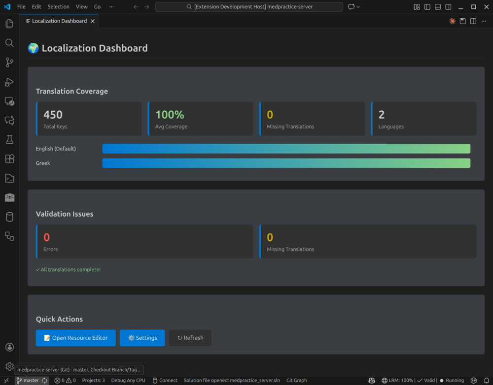
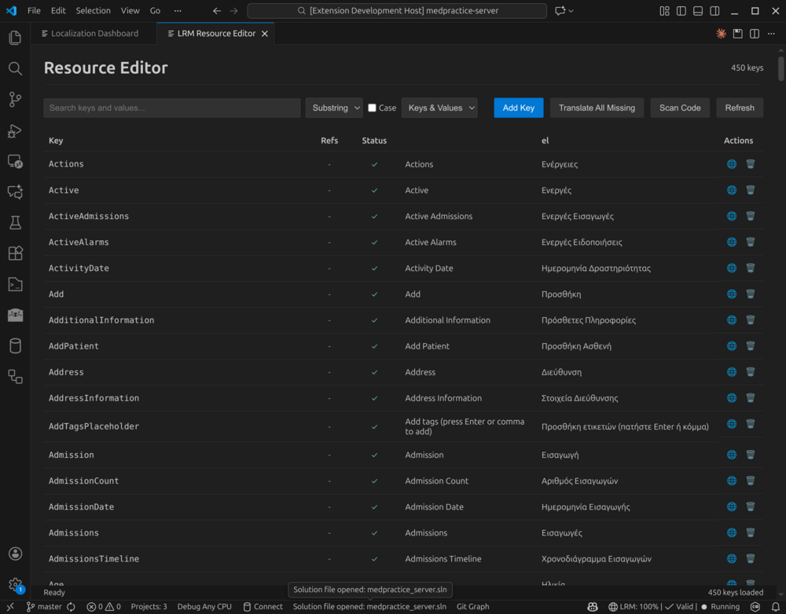
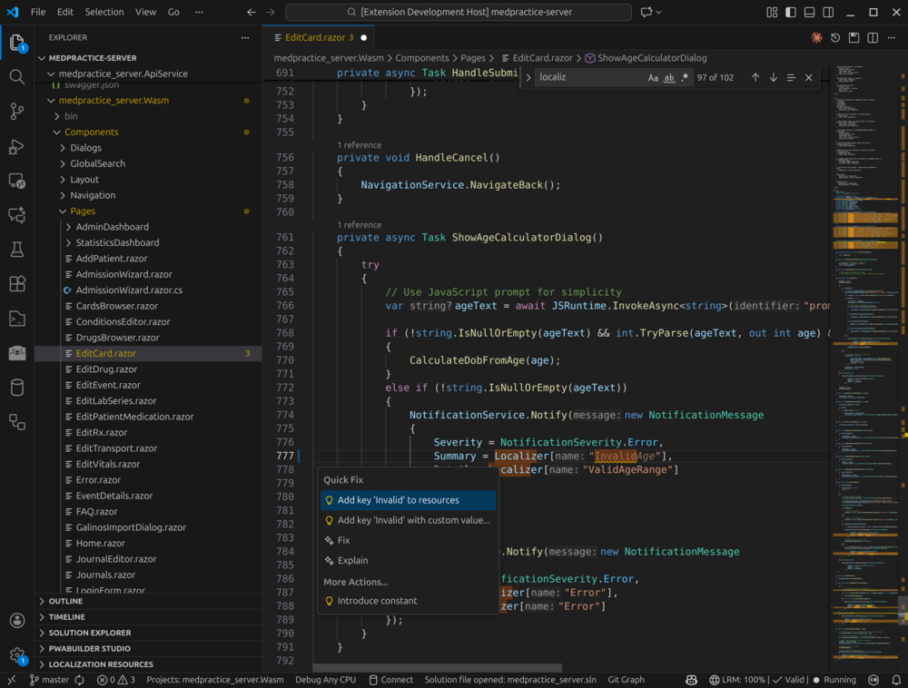
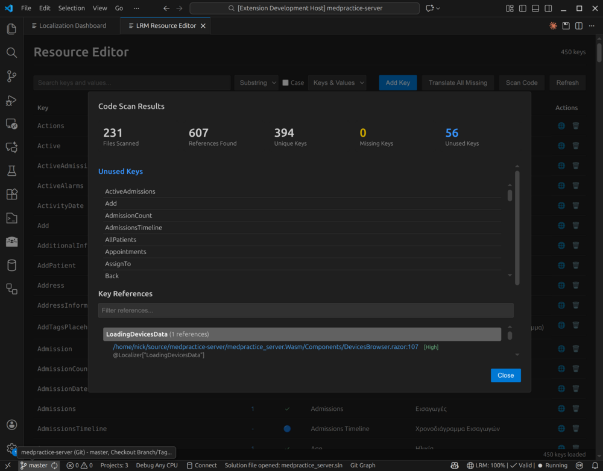
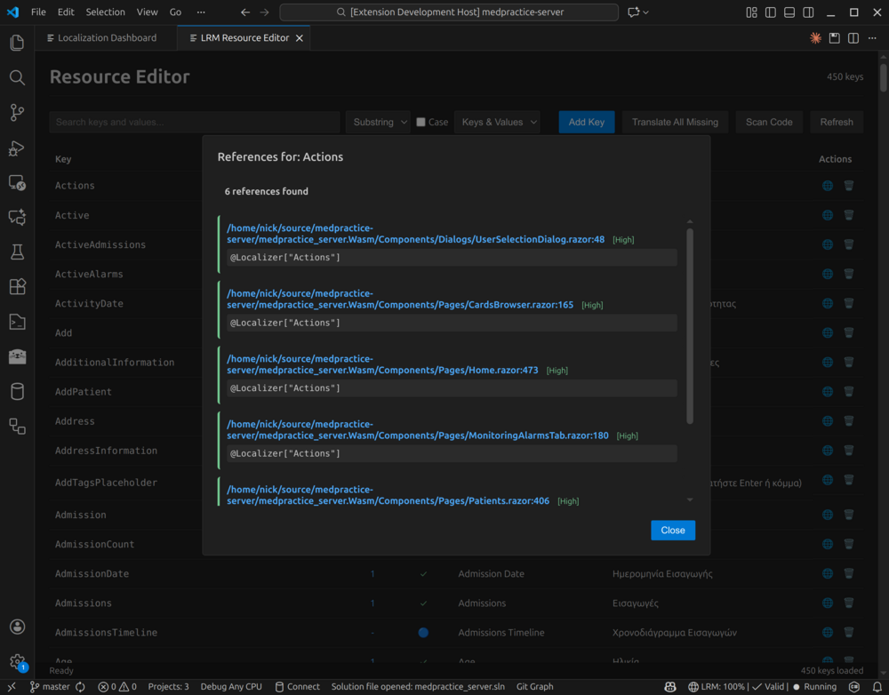
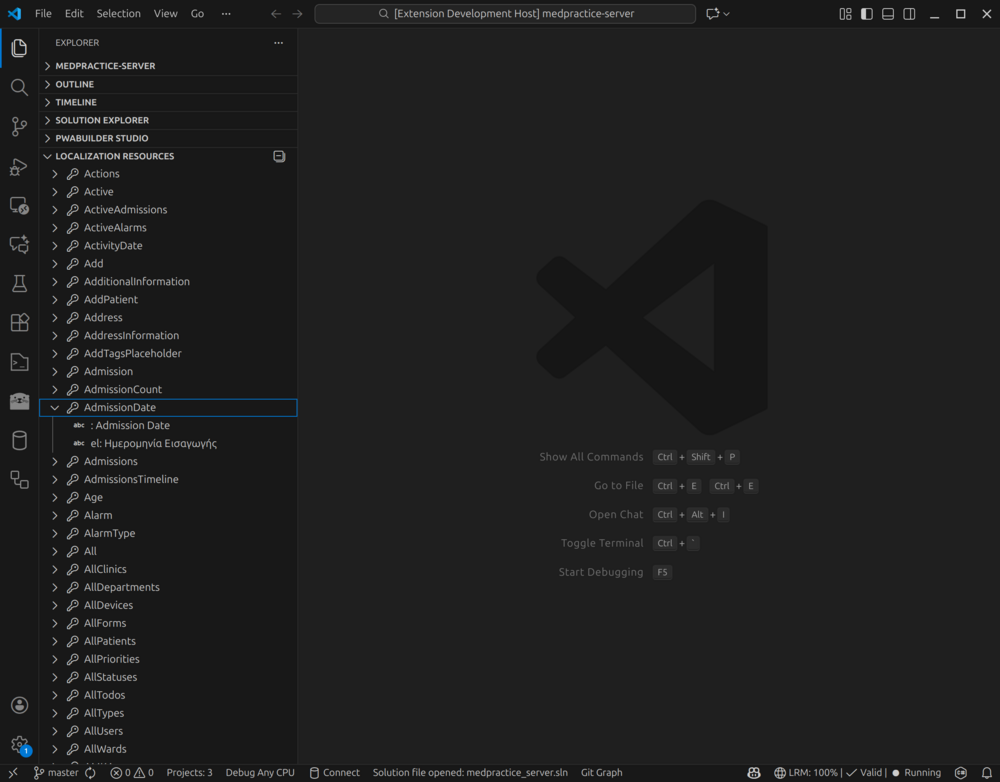

# Localization Manager

Manage .NET .resx localization files with real-time validation, translation, and code scanning.

## Features

### Dashboard
View translation coverage, validation issues, and quick actions at a glance.

### Resource Editor
Edit all languages side-by-side with search, filtering, and bulk actions.

### Real-time Code Diagnostics
Get inline warnings for missing localization keys as you type.

### Code Scanning
Find missing and unused keys across your codebase.

### Key References
See exactly where each key is used in your code.

### Resource Tree
Browse keys organized by resource file in the Explorer sidebar.

### Translation
Translate missing values using free or paid providers.
- **Free (no API key)**: Lingva, MyMemory
- **Free (local AI)**: Ollama - run AI translation locally, completely free and private
- **Paid**: Google, Azure, AWS, DeepL, OpenAI, Anthropic

## Requirements
- VS Code 1.80+
- Workspace with .NET .resx files

## Quick Start
1. Install the extension
2. Open a workspace containing .resx files
3. The extension auto-detects resources and starts the backend
4. Use Command Palette (Ctrl+Shift+P) → "LRM:" commands

## Commands
| Command | Description |
|---------|-------------|
| LRM: Open Dashboard | View coverage and validation status |
| LRM: Open Resource Editor | Edit resources in web UI |
| LRM: Validate Resources | Check for issues |
| LRM: Scan Code | Find missing/unused keys |
| LRM: Add Key | Add new localization key |
| LRM: Translate Missing Values | Auto-translate |
| LRM: Set Resource Path | Configure resource location |

## Settings
| Setting | Description | Default |
|---------|-------------|---------|
| `lrm.resourcePath` | Path to .resx folder | Auto-detected |
| `lrm.translationProvider` | Default provider | `lingva` |
| `lrm.enableRealtimeScan` | Live diagnostics | `true` |
| `lrm.scanOnSave` | Scan on file save | `true` |

## Troubleshooting
- **Backend won't start**: Check "LRM Backend" output channel
- **Resources not detected**: Use "LRM: Set Resource Path"
- **Translation fails**: Free providers need no setup; paid need API keys

## Release Notes

### 0.6.17
See [CHANGELOG](https://github.com/nickprotop/LocalizationManager/blob/main/CHANGELOG.md)

## License
MIT - [Nikolaos Protopapas](https://github.com/nickprotop)
